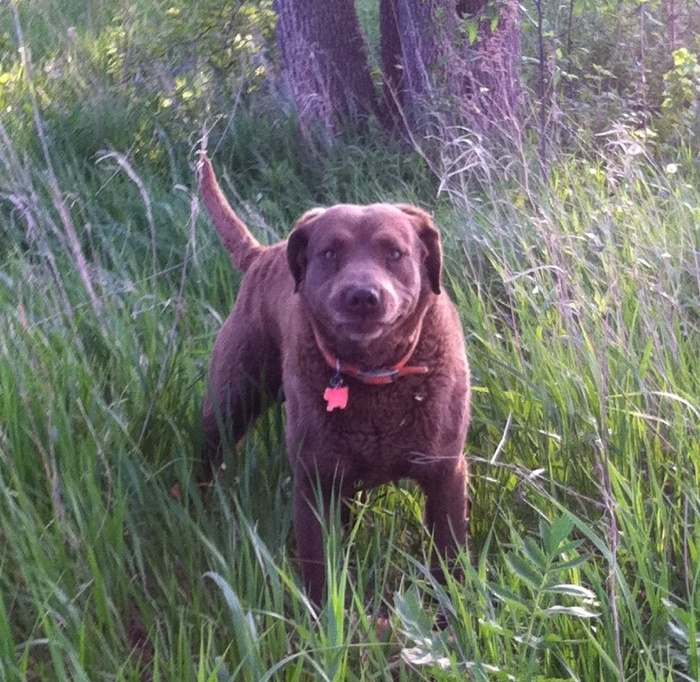

!SLIDE center
# RubyMotion
## Ruby for iOS

!SLIDE center
# About.me
## @darrinholst on app.net

!SLIDE center
## <marquee style="width: 400px;">I am a web developer<marquee>

!SLIDE center

  

!SLIDE center
# Certified  Fanboy

!SLIDE center
## Almost an iOS developer for 5+ years

!SLIDE center
# Xcode

!SLIDE center
# Objective-C

!SLIDE center
# Xcode ___and___ Objective-C

!SLIDE center
# Xcode

!SLIDE center

!SLIDE center
# Objective-C

!SLIDE center

!SLIDE center
# Alternatives?

!SLIDE center
# Mobile Web
### lol add to home screen
.notes appstore

!SLIDE center
# PhoneGap

.notes replicated native look and feel, slow

!SLIDE center
# Titanium
### bridges are _ok_
.notes javascript bridge into native land

!SLIDE center

!SLIDE center
## before we get to the Holy Grail...

!SLIDE center
# MacRuby
## Ruby for the Objective-C Runtime
### Laurent Sansonetti (Apple Inc.)
### 2007 - present
.notes ruby implementation, ruby 1.9, LLVM

!SLIDE center
# RubyMotion
## Ruby for iOS
### Laurent Sansonetti (HipByte)
### 2012 - present

#### <a href="http://www.cornify.com" class="blink" onclick="cornify_add();return false;">Don't Click Me!</a>

.notes fork of MacRuby

!SLIDE bullets center
# Why RubyMotion #
* __Ruby__Motion
* Bring your own ide
* Command Line w/REPL
* Testing

!SLIDE center
## Ruby 1.9 syntax...for the most part

!SLIDE
    @@@ ruby
    def methodName(arg1, withNamed: arg2)
    end

!SLIDE code
    @@@ ruby
    UIBarButtonItem.alloc.initWithTitle(
      "MOAR",
      style: UIBarButtonItemStyleBordered,
      target: self,
      action: "push"
    )

.notes selectors vs. blocks

!SLIDE center
# No `require`
### Application is statically compiled

!SLIDE center
# No `eval`
### You used that?

!SLIDE center
# Yes `send`, `define_method`, `alias_method`, `instance_eval`, `class_eval`,
`...`
### http://clayallsopp.com/posts/rubymotion-metaprogramming/

!SLIDE center
# Let's get started
## but first...

!SLIDE center

!SLIDE code
    $ motion create demo
.notes show rake, rake config, appdelegate

!SLIDE center
# Now What?

!SLIDE center
# Cocoa Touch
### docs
### docs
### dash
.notes the sdk is not hidden from you, documentation reading

!SLIDE center
# RubyGems
### Remember that no `require` thing?

!SLIDE
# Bundler
### Add to Rakefile...
    @@@ ruby
    require 'bundler'
    Bundler.require

!SLIDE center
## [http://rubymotion-wrappers.com/](http://rubymotion-wrappers.com/)

!SLIDE center
# IB

!SLIDE center
# Autolayout

!SLIDE
# W T F
    @@@
    H:|-[sprint_label]-|
    H:|-[starts_label(==ends_label)]-1-[separator_label(15)]-1-[ends_label]-|
    V:|-10-[sprint_label]-10-[starts_label(==height)]-|
    V:|-10-[sprint_label]-10-[separator_label(==height)]-|
    V:|-10-[sprint_label]-10-[ends_label(==height)]-|

!SLIDE
# BubbleWrap
### [https://github.com/rubymotion/BubbleWrap](https://github.com/rubymotion/BubbleWrap)
### too much to slow in a slide, you're going to want it
    @@@ ruby
    "#bada55".to_color

!SLIDE
# ProMotion
### [https://github.com/clearsightstudio/ProMotion](https://github.com/clearsightstudio/ProMotion)
### tries to take all the Objective-C out
    @@@ ruby
    class AppDelegate < ProMotion::AppDelegateParent
      def on_load(app, options)
        open HomeScreen.new(nav_bar: true)
      end
    end

!SLIDE center
# CocoaPods
### [http://cocoapods.org/](http://cocoapods.org/)

!SLIDE center
# vendor/
### Xcode project
### Source code

!SLIDE center
# debuggin
### gdb (the neckbeard way)
### RubyMine (the other way)

!SLIDE center
# testin
### http://www.rubymotion.com/developer-center/articles/testing/

!SLIDE center

!SLIDE center bullets
* [http://rubymotion.com](http://rubymotion.com)
* [http://rubymotion-tutorial.com](http://rubymotion-tutorial.com)
* iOS Programming: The Big Nerd Ranch Guide

!SLIDE center

